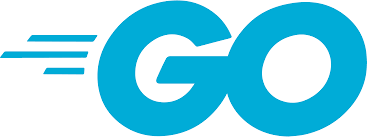

# CRUD app in GoLang

## About

This is a learning project which uses some third party dependencies to build a fully funciton GoLang Web Server with Session based auth and custom authorization built in it.
